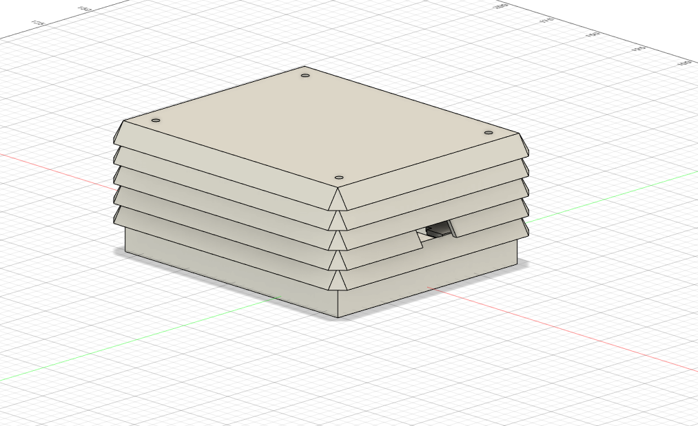

# METEO STATION – 3D prints

  
&nbsp; &nbsp; &nbsp;
  

### ◾ About the project

**Meteo station** is my small after-hours project that contains of **three** repositories:
- Meteo station 3D prints (this repo)
- [Meteo station PCB based on ESP32 ](https://github.com/alicjamusial/meteo-station-pcb)
- [Meteo station code](https://github.com/alicjamusial/meteo-station-code)

As the name suggest, is a DIY self-sufficient weather measuring device. I decided to design it as a PCB board with goldpins to stick-in or stick-out individual components and sensors (ESP32, BME280 etc.) to make it more reusable. It could have - of course - been integrated on board, but it would be more expensive and time-consuming to create.

All 3D prints were designed using Autodesk Fusion 360. If you are professionally connected to mechanics, please do not judge this design - I made it without going into the principles of designing the perfect mechanics. Sorry in advance.

> **Warning**  
> This is a hobbyist project. I'm not an professional mechanical or electronic engineer so I take no responsibility for any possible issues you may encounter :)

I was inspired by solution created by [this guy on Instructables](https://www.instructables.com/Solar-Powered-WiFi-Weather-Station-V30/). He did a good job, so I strongly recommand exploring his meteo projects!

### ◾ 3D printing
**Components:**
- `Layer0.stl` - first part of the Stevenson cage, with a cut for temperature sensor, holes in the bottom so that the water can run off, and holes for spacers,
- `Layer1.stl` - next part of the Stevenson cage, with cut for the USB cable to solar panel,
- `Layer2.stl` - next part of the Stevenson cage, with second cut for the USB cable to solar panel,
- `Layer3-multiple.stl` - standard part of the Stevenson cage, print as many as you need,
- `LayerTop.stl` - top part of the Stevenson cage.

**Other stuff that you need:**
- access to 3D printer to print it (I used Ender 5 Pro with white ABS and PLA filament),
- a slicer (I used Ultimaker Cura),
- screwed spacer sleeves to connect all elements of Stevenson cage together.

  
&nbsp; &nbsp; &nbsp;
  

### ◾ Known issues

- there should be a hole to place a lightning sensor near the solar panel somewhere (with cable going to the Stevenson cage),
- the solar panel holder is extremely big - it barely fits in a 3d printer 🙂  The best solution would be to choose smaller but effective solar panels - unfortunately, I couldn't find any,
- Stevenson cage would be better if it was designed to hold the PCB aslant.

### ◾ Adjust it to your needs!
This is an absolutely hobbyst project :) You can use it as a reference to create something loads better.

### ◾ License
Meteo Station project is available on Creative Commons Attribution Share Alike 4.0 International license (more in [license file](LICENSE.txt)). You are free to use it, modify it and produce as many of your own boards as you need.

### ◾ Final result

Cable tie and tape for the win ;)

  

